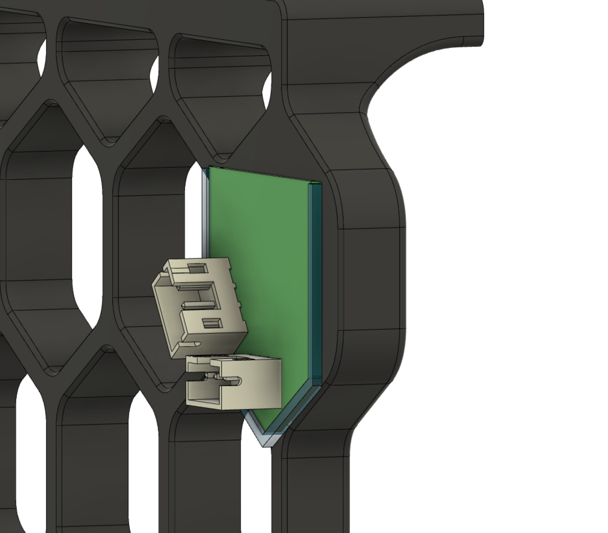
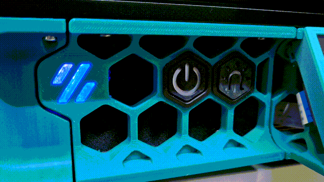

**BOM**
|Part NO.  |Qty  |LCSC  |
|--|--|--|
| Conn_01x03 | 2 | C131339 |
| WS2812-2020 | 12 | C965555 |

**Assembly**
- Order the pcb at e.g. [pcbway](https://www.pcbway.com/project/shareproject/Trident_Skirt_Lights_6d030a0b.html) or [jlcpcb](https://jlcpcb.com/) (you need two for one printer)
- Order the parts at e.g. [lcsc](https://www.lcsc.com/)
- Print the new skirts (You WILL need supports)
- Print the new logo inserts (You WILL need supports)
- in the meantime, assemble the pcb
- Push in the new logo inserts in your skirts
- Push the pcb into the logo insert, no additional fasteing required
- Wire up the pcbs to your controller
- Add them as normal neopixels to your config
```
[neopixel my_skirts]
pin: YOUR_NEOPIXEL_PIN
chain_count: 24
initial_RED: 1.0
```

- 
- 

## Notes
- This readme file contains Amazon Associate, Aliexpress affiliate, PCBWay affiliate links. I make a comission on qualifying purchases.
- This project does not come with any warranty, if you choose to build/use one, you are doing this at your own risk!